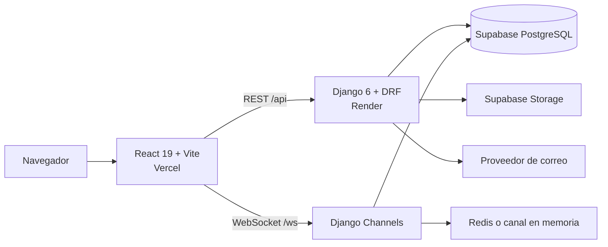
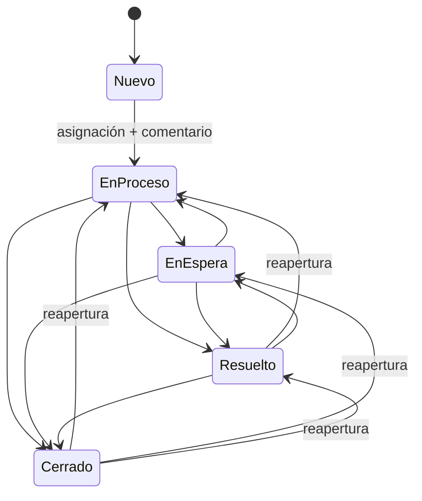

# SassBlum

[](https://github.com/edarmijo/Sassblum/actions/workflows/ci.yml)
[](frontend/package.json)
[](backend/requirements.txt)
[](frontend/package.json)

Plataforma web de gestión de tickets para SassBlum, empresa de servicios tecnológicos de
Guayaquil. Centraliza solicitudes, asignaciones, seguimiento, notificaciones y reportes en un
flujo trazable para clientes, trabajadores y administradores.

[Aplicación](https://sassblum.vercel.app/) ·
[Estado de la API](https://sassblum.onrender.com/health/) ·
[Documentación](docs/README.md) ·
[Guía de usuario](docs/USER_GUIDE.md) ·
[Manual de entrega al cliente](docs/client-manual-latex/README.md) ·
[Despliegue](docs/DEPLOYMENT.md)

> Estado de entrega: aplicación desplegada y suites locales verificadas el 15 de agosto de 2026.
> Los resultados son una línea base reproducible, no una garantía de disponibilidad futura.

## Qué resuelve

- Los clientes registran solicitudes, adjuntan evidencia y consultan su historial.
- Los administradores gestionan usuarios, asignan o reasignan tickets y consultan reportes.
- Los trabajadores documentan avances y cambian estados con un comentario obligatorio.
- Los eventos generan notificaciones en la aplicación, por correo y mediante WebSocket según la
  configuración del entorno.
- El historial conserva autor, fecha, comentario, asignación y transición para auditoría.
- Los reportes se exportan en PDF y Excel.

## Arquitectura



El frontend usa módulos por dominio y consume servicios mediante Context/hooks. En el backend,
las vistas orquestan HTTP, los servicios contienen reglas de negocio y los repositorios aíslan el
ORM. Los detalles y decisiones están en [Arquitectura](docs/ARCHITECTURE.md).

### Ciclo de vida del ticket



`Nuevo` solo puede pasar a `EnProceso` después de asignar un trabajador. Los cuatro estados
operativos son intercambiables por personal autorizado; `Cerrado` no es terminal. Toda transición
requiere un comentario no vacío (BR-35).

## Tecnologías principales

| Capa | Tecnología |
|---|---|
| Interfaz | React 19, TypeScript 6, Vite 8, Tailwind CSS 4, Framer Motion |
| API | Django 6, Django REST Framework, SimpleJWT |
| Datos | Supabase PostgreSQL 15, Supabase Storage |
| Tiempo real | Django Channels, Redis |
| Reportes | ReportLab, OpenPyXL, Recharts |
| Calidad | pytest, Vitest, React Testing Library, ESLint, Flake8, SonarCloud |
| Entrega | Vercel, Render, Docker Compose, GitHub Actions; Jenkins disponible para self-hosting |

## Inicio rápido local

### Requisitos

- Python 3.12 o compatible con Django 6
- Node.js 24 y npm 11 (versiones usadas por CI)
- PostgreSQL accesible mediante `DATABASE_URL`
- Redis opcional en desarrollo; obligatorio si se ejecutan varios procesos de Channels

### Backend

```bash
cd backend
python -m venv .venv
# Linux/macOS: source .venv/bin/activate
# Windows PowerShell: .venv\Scripts\Activate.ps1
pip install -r requirements.txt
cp .env.example .env
python manage.py migrate
daphne config.asgi:application
```

Edita `backend/.env` antes de migrar. Nunca confirmes ese archivo en Git.

### Frontend

```bash
cd frontend
npm ci
cp .env.example .env
npm run dev
```

En desarrollo, configura `VITE_API_BASE_URL=http://localhost:8000/api` y
`VITE_WS_URL=ws://localhost:8000`. La aplicación queda disponible en
`http://localhost:5173` y el health check en `http://localhost:8000/health/`.

### Datos de demostración

```bash
cd backend
SEED_DEMO_PASSWORD='<contraseña-temporal>' python manage.py seed_demo --confirm-demo
```

En PowerShell usa `$env:SEED_DEMO_PASSWORD='<contraseña-temporal>'`. Si no se define, el comando
genera una contraseña aleatoria y la muestra una sola vez. Con `DEBUG=False`, un staging aislado
también debe definir `ALLOW_DEMO_SEED=True`. No habilites esa variable ni uses cuentas demo en
producción.

## Verificación

```bash
# Backend: sistema, linter y suite completa
cd backend
python manage.py check
flake8 apps config core --max-line-length=120 --exclude=migrations
pytest

# Aceptación
pytest ../tests/acceptance

# Frontend
cd ../frontend
npm run lint
npm run build
npm run test
```

Línea base local del 15-08-2026: **190** pruebas backend, **51** de aceptación y **104** frontend
aprobadas; build y linters sin errores después de las correcciones de este cierre. Consulta el
[plan de pruebas](docs/TESTING.md) para alcance, riesgos y criterios de salida.

## Documentación

| Audiencia | Documento |
|---|---|
| Cliente y usuarios | [Guía de usuario](docs/USER_GUIDE.md) |
| Desarrollo | [Arquitectura](docs/ARCHITECTURE.md) y [contribución](CONTRIBUTING.md) |
| Operaciones | [Despliegue, respaldo y rollback](docs/DEPLOYMENT.md) |
| Calidad | [Plan de pruebas](docs/TESTING.md) |
| Cliente y responsables operativos | [Manual integral de entrega](docs/client-manual-latex/README.md) |
| Seguridad | [Política de seguridad](SECURITY.md) |
| Historial | [Changelog](CHANGELOG.md) |

## Seguridad y datos

- El backend aplica permisos por rol y filtra los tickets por usuario.
- El access token vive en memoria; el refresh token se transporta en cookie `HttpOnly`.
- Los secretos se leen desde variables de entorno y los ejemplos solo contienen marcadores.
- No publiques capturas, comunicaciones ni exportaciones con datos personales del cliente.

Reporta vulnerabilidades siguiendo [SECURITY.md](SECURITY.md), no mediante un issue público.

## Equipo

Proyecto desarrollado en ESPOL - FIEC por Erick Armijos, Juan Pérez, Elías Rubio, Jahir Cajas y
Jairo Rodríguez para SassBlum, representada por Vicky Pinto.

## Licencia y propiedad intelectual

Este repositorio no declara una licencia de código abierto. La ausencia de una licencia no concede
permiso de uso, copia, modificación o redistribución. La titularidad y cualquier licencia de entrega
deben formalizarse por escrito entre SassBlum, el equipo y ESPOL antes de una transferencia final.
