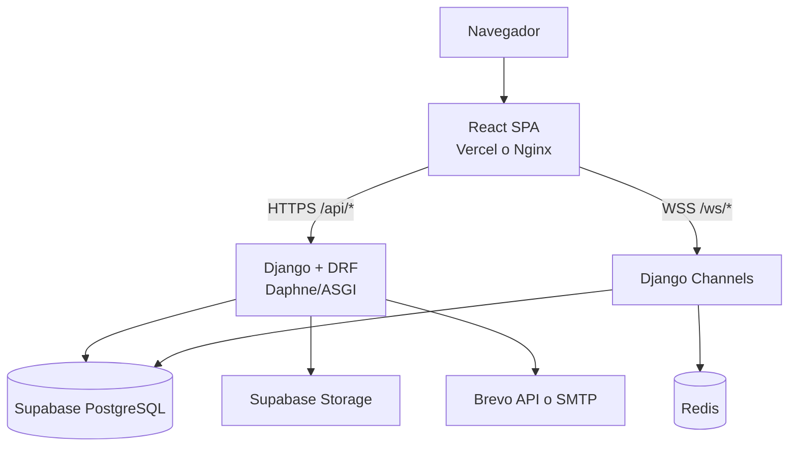

# Arquitectura de SassBlum

## Vista general

SassBlum es una SPA React que consume una API Django y dos canales WebSocket. La base de datos es
PostgreSQL en Supabase; Redis actúa como channel layer cuando el backend usa más de un proceso.



La topología desplegada actualmente es Vercel → rewrite `/api/*` → Render. WebSocket conecta
directamente a Render porque el rewrite de Vercel no lo proxifica.

## Límites del sistema

### Frontend

`frontend/src/modules/` agrupa los dominios `auth`, `catalog`, `clients`, `contracts`, `dashboard`,
`gallery`, `notifications`, `public`, `reports`, `testimonials` y `tickets`.

Flujo típico:

```text
Page/Component → Context/Hook → Interface → Service → ApiClient/SocketClient
```

Los componentes no deben instanciar servicios concretos. `ApiClient` conserva el access token en
memoria y usa la cookie `HttpOnly` para rehidratar la sesión.

### Backend

`backend/apps/` contiene `authentication`, `catalog`, `clientes`, `gallery`, `notifications`,
`realtime`, `reports`, `testimonials` y `tickets`.

Flujo típico:

```text
URL → View/Serializer → Service → Repository → Model/PostgreSQL
                          └→ Strategy/Factory/State machine
```

- Las vistas traducen HTTP y permisos.
- Los servicios aplican reglas de negocio y coordinan casos de uso.
- Los repositorios contienen consultas ORM.
- Las estrategias encapsulan canales de notificación y exportadores.
- Los eventos de ticket alimentan notificaciones y actualizaciones en tiempo real.

## Roles y autorización

| Rol | Acceso principal |
|---|---|
| Cliente | Crear tickets y consultar solo los propios; gestionar su testimonio |
| Trabajador | Consultar trabajo asignado, comentar y cambiar estados operativos |
| Administrador | Ver todos los tickets, asignar/reasignar, gestionar usuarios, contenido y reportes |

La interfaz oculta acciones no permitidas, pero la decisión autoritativa vive en permisos y
servicios del backend. El aislamiento de tickets se implementa mediante filtros del backend; no se
debe presentar como RLS general de Supabase.

## Estado del ticket

`Nuevo` representa una solicitud todavía no asignada. La asignación inicial lleva el ticket a
`EnProceso`. Desde allí, trabajadores y administradores pueden moverlo entre `EnProceso`,
`EnEspera`, `Resuelto` y `Cerrado`, incluidas reaperturas. Cada transición exige comentario.

La fuente de verdad es
`backend/apps/tickets/state_machine/ticket_state_machine.py` y sus pruebas en
`backend/apps/tickets/tests/test_state_machine.py`.

## Superficie HTTP principal

| Método | Ruta | Propósito |
|---|---|---|
| POST | `/api/auth/register` | Registro de cliente |
| POST | `/api/auth/login` | Inicio de sesión y cookie de refresh |
| POST | `/api/auth/token/refresh` | Renovación de sesión |
| POST | `/api/auth/verify-email` | Verificación de correo |
| GET/POST | `/api/tickets/` | Listar por rol / crear como cliente |
| GET | `/api/tickets/{id}` | Detalle autorizado |
| PATCH | `/api/tickets/{id}/asignar` | Asignación por administrador |
| PATCH | `/api/tickets/{id}/reasignar` | Reasignación por administrador |
| PATCH | `/api/tickets/{id}/estado` | Cambio de estado por personal |
| POST | `/api/tickets/{id}/comentario` | Nuevo comentario |
| GET | `/api/reportes/tickets` | KPIs para administrador |
| POST | `/api/reportes/exportar` | Exportación PDF o Excel |
| GET | `/health/` | Salud de aplicación y base de datos |

Cada app conserva sus rutas en `backend/apps/<app>/urls.py`; esa es la referencia exhaustiva hasta
que se incorpore un esquema OpenAPI.

## WebSocket

| Ruta | Consumidor |
|---|---|
| `/ws/notifications/` | Notificaciones del usuario autenticado |
| `/ws/tickets/{ticket_id}/` | Actualizaciones de un ticket autorizado |

## Decisiones y limitaciones operativas

- Con `USE_REDIS=False`, Channels usa memoria y solo es correcto para un proceso backend.
- Los jobs de GitHub Actions validan el código; no despliegan producción.
- Jenkins construye imágenes para el flujo self-hosted, pero el despliegue debe activarse y
  verificarse explícitamente antes de llamarlo CD automático.
- La propiedad intelectual y la licencia de entrega siguen siendo una decisión contractual.
